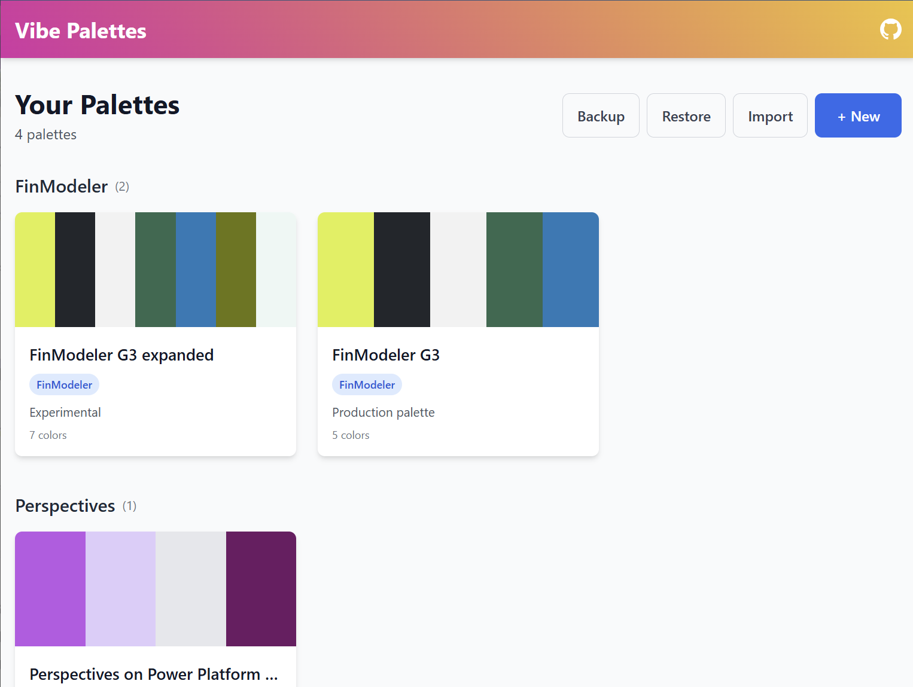

# Vibe Palettes

A minimal, focused color palette manager for marketers and non-designers who need a simple tool to manage brand colors.

Create and organize color palettes for websites, slide decks, thumbnails, and social graphics—without the complexity of professional design tools.

## What It Looks Like

### Create and Edit Palettes with Live Preview


Edit your colors with a visual color picker, generate shades, assign semantic roles (primary, accent, background, text), and see a live preview of how your palette looks in real UI elements.

### Organize Your Palettes by Brand



Group palettes by brand or project. Quickly browse all your color schemes in one place with backup/restore functionality.

## Key Features

✨ **Visual Color Editing** - Pick colors with an intuitive color picker and see instant previews

🎨 **Automatic Shade Generation** - Generate light and dark variations of any color with one click

👁️ **Live UI Preview** - See how your palette looks in buttons, tags, links, and backgrounds

🏷️ **Semantic Color Roles** - Assign roles (primary, accent, background, text) for better organization

📁 **Brand Organization** - Group palettes by brand or project for easy management

💾 **Backup & Restore** - Export and import your entire palette collection

📋 **Export Options** - Export as JSON or human-readable text for AI prompts

🚀 **No Backend Required** - Everything runs in your browser with localStorage

📱 **Responsive Design** - Works seamlessly on laptop and tablet

## Getting Started

Try it now! The app runs entirely in your browser—no signup or backend required.

### Install dependencies

```bash
npm install
```

### Run the development server

```bash
npm run dev
```

The app will be available at `http://localhost:5173/`

### Build for production

```bash
npm run build
```

The production build will be in the `dist` folder.

### Preview production build

```bash
npm run preview
```

## How to Use

### Creating Your First Palette

1. Click **+ New** on the palette list page
2. Choose a base color—the app will generate 5 harmonious colors automatically
3. Edit colors, assign roles, and see the live preview update instantly
4. Click **Save** when you're done

### Organizing Palettes

- **Brand field**: Group related palettes (e.g., "ClientName" or "Project2024")
- **Notes**: Add context like "Summer campaign" or "Website redesign"
- The list view automatically groups palettes by brand

### Working with Colors

- **Color Picker**: Click the color swatch to open a visual picker
- **Generate Shades**: Click "Shades" to explore 12+ variations from light to dark
- **Copy Colors**: Click "Copy" next to any color to copy the hex code
- **Reorder**: Use arrow buttons to change the color order
- **Color Roles**: Assign semantic roles to see accurate previews

### Exporting

- **JSON**: Structured data for programmatic use
- **Chat Text**: Human-readable format perfect for pasting into AI prompts
- **Backup/Restore**: Export all palettes at once from the main list view

## How It Works

### Data Storage

All palettes are stored in your browser's localStorage under the key `"vibe-palettes-v1"`.

- **First time**: The app creates a default example palette to get you started
- **Persistence**: Your palettes are saved automatically whenever you make changes
- **No cloud sync**: Everything stays in your browser

### Resetting/Wiping Data

If you want to start fresh and clear all palettes:

1. Open your browser's developer console (F12)
2. Run this command:
   ```javascript
   localStorage.removeItem('vibe-palettes-v1')
   ```
3. Refresh the page

The app will recreate the default example palette.

## Tech Stack

- **React 18** + **TypeScript** for type-safe UI development
- **Vite** for fast builds and dev experience
- **Tailwind CSS** for utility-first styling
- **localStorage** for client-side data persistence

## For Developers

### Project Structure

```
vibe-palette/
├── src/
│   ├── lib/
│   │   ├── paletteTypes.ts      # TypeScript interfaces
│   │   ├── storage.ts           # localStorage helpers
│   │   └── colorUtils.ts        # Color manipulation utilities
│   ├── components/
│   │   ├── Toast.tsx            # Toast notification system
│   │   ├── ShadesModal.tsx      # Shade explorer modal
│   │   └── ExportModal.tsx      # Export modal (JSON/text)
│   ├── views/
│   │   ├── PaletteList.tsx      # Gallery view of all palettes
│   │   └── PaletteEditor.tsx    # Edit a single palette
│   ├── App.tsx                  # Main app component
│   ├── main.tsx                 # Entry point
│   └── index.css                # Global styles + Tailwind
├── package.json
├── vite.config.ts
├── tailwind.config.js
└── tsconfig.json
```

### Key Components

- **PaletteList**: Displays all palettes as cards, grouped by brand
- **PaletteEditor**: Split view with metadata/colors on left, live preview on right
- **ShadesModal**: Interactive shade generator with ~12 variations per color
- **ExportModal**: Export palettes as JSON or human-readable text

## License

MIT

## Contributing

This is a simple, focused tool. If you want to add features, feel free to fork and customize for your needs!
